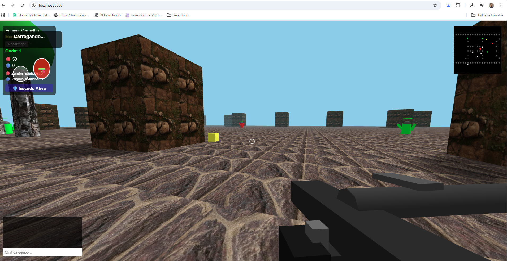

<h1 align="center">
    
</h1>

 

🎮 Sobre o Projeto
Paintball Multiplayer é um jogo de tiro em tempo real desenvolvido com Node.js e Socket.io, onde múltiplos jogadores podem competir em uma arena virtual. O jogo oferece uma experiência de combate dinâmica com movimentação suave e sistema de pontuação em tempo real.

# Passo 1: Estrutura de Pastas
Organize seus arquivos da seguinte forma. Isso é crucial para que o servidor encontre os arquivos estáticos (HTML, CSS, JS).

/paintball 

├── server.js 

├── package.json 

└── /public 

    ├── index.html     
    ├── script.js     
    └── style.css 
    
	
# Passo 2: Instalar as Dependências
Abra o seu terminal.
Navegue até a pasta principal do seu projeto (paintball) usando o comando cd. Exemplo:
bash

# Exemplo para Windows
cd C:\Users\SeuUsuario\Documentos\paintball

# Exemplo para macOS/Linux
cd ~/Documents/paintball
Uma vez dentro da pasta, execute o seguinte comando:

npm install

Este comando lerá o arquivo package.json e baixará as dependências (express e socket.io) para uma nova pasta 
chamada node_modules. Você só precisa fazer isso uma vez (ou sempre que adicionar uma nova dependência).

#Passo 3: Iniciar o Servidor
Agora que tudo está instalado, você pode iniciar o servidor. No mesmo terminal, na mesma pasta, execute:

npm start

Você deverá ver uma mensagem como esta no terminal, indicando que o servidor está online:

🎮 Servidor Paintball rodando na porta 5000
🔗 Acesse: http://localhost:5000
🔧 Teste Socket.IO: http://localhost:5000/socket-test
Deixe esta janela do terminal aberta! Se você fechá-la, o servidor será desligado.

# Passo 4: Acessar o Jogo
Abra o seu navegador web (Chrome, Firefox, etc.).
Na barra de endereços, digite: http://localhost:5000
Pressione Enter.
A tela de login do jogo de paintball deverá aparecer!

Para Jogar com Outros na Mesma Rede (Local) 

http://seuip:5000 para jogar com outros enviar este link

👤 Autor
Luiz Fernando Barbosa

